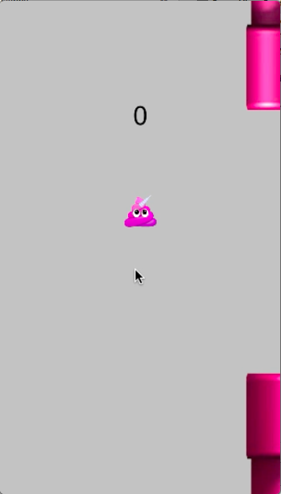
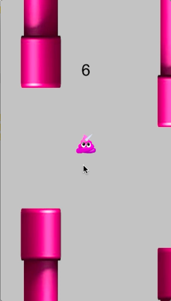
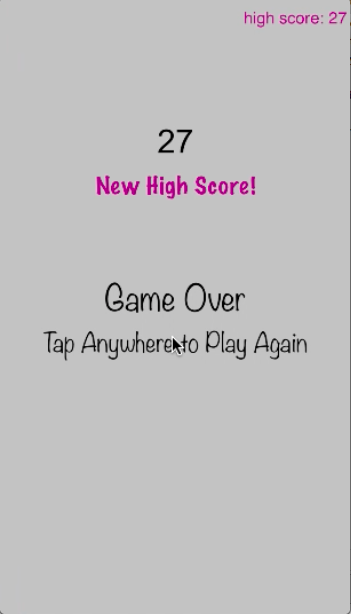

## Hello World

My name is Kathy Wu and I'm a student studying computer science at UC Berkeley. Welcome to my website! You can check out some of my personal projects below. 

### Chess!

<iframe width="560" height="315" src="https://www.youtube.com/embed/lwykg7sB6zg" frameborder="0" allow="accelerometer; autoplay; encrypted-media; gyroscope; picture-in-picture" allowfullscreen></iframe>

Chess! is a fully functioning chess game created using Java GUI. While it was originally created as a final project for an AP Computer Science class, it has since expanded to include features such as sound effects, suggestions for next moves, and custom game pieces. The board changes color to indicate the changing of a player's turn. There are also green dots that show what moves are possible for a given piece. 

### Pipe Adventure

        

Pipe Adventure is a rendition of the iPhone app Flappy Bird, created with Swift. The premise is that a pink unicorn poop is finding its way around a maze of endless pipes— in this respect I would say that it is more realistic than Flappy Bird, considering that the game is really just about a piece of human waste making its way through the sewage system. Its physics system could use improvement, but otherwise it is fully functional! The distance between pipes gets smaller as you progress through the game, and there are satisfying sound effects for when you pass through pipes.

### Skills

Many, many lines of code written in Java and C++.
Many lines of code written in Swift and HTML/CSS/Javascript.
Familiar with Python.

CS Classes taken: APCS, Stanford CS 106B, Stanford CS 193C

### More about me!

Coming soon.

### Contact

Contact me [here!](kathywu@berkeley.edu)
Feel free to give suggestions for this website!

### More Coming Soon...
